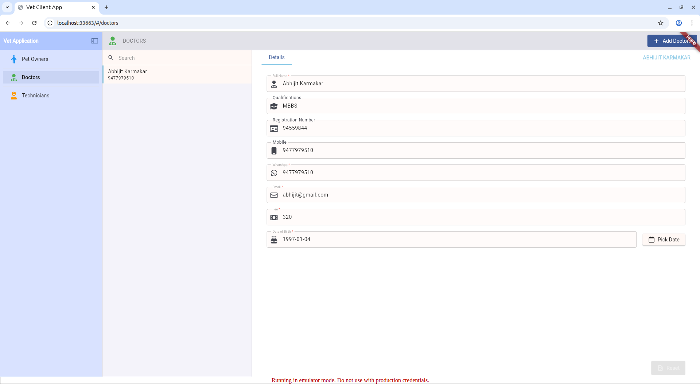
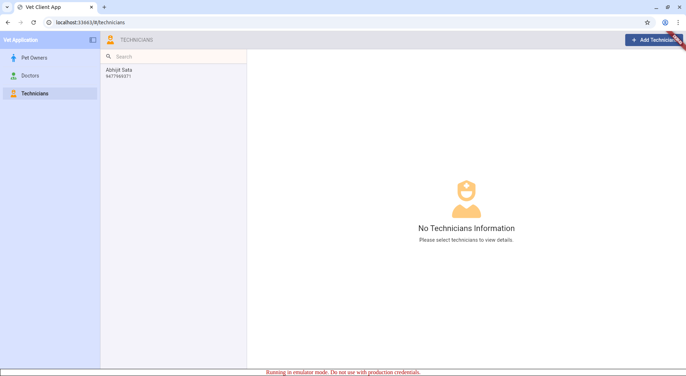
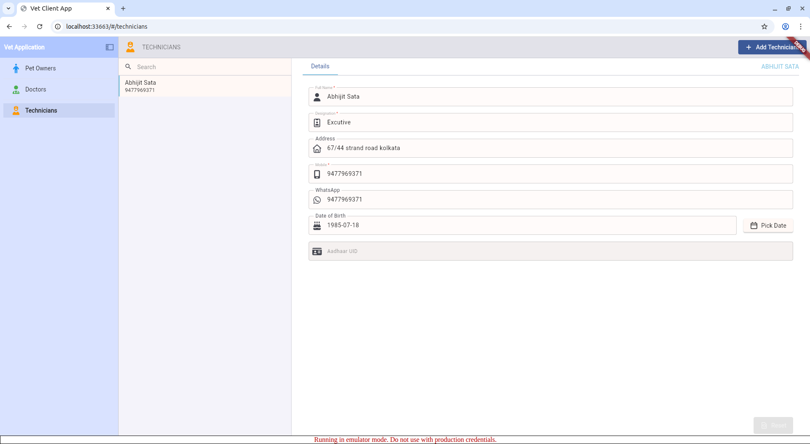
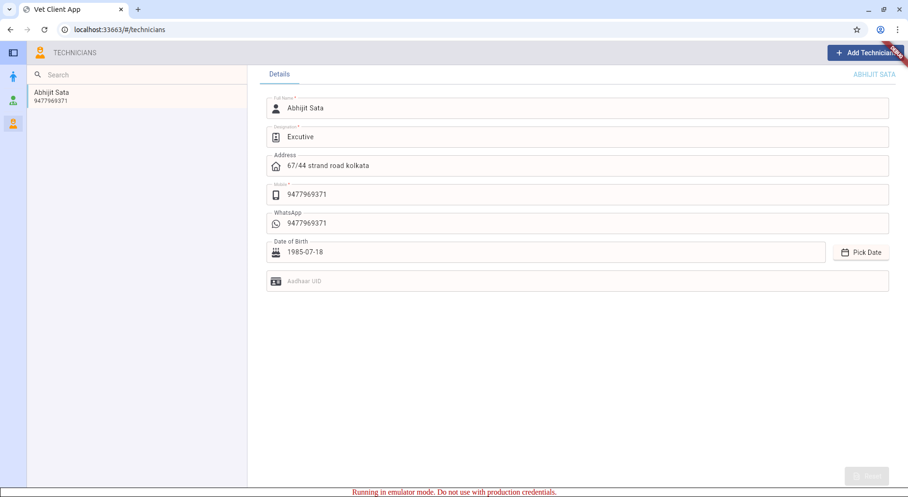

# web_ui_plugins

## 🚀 WebUI Plugins: The SaaS Builder's Dream

Building SaaS applications doesn't have to be complex. **WebUI Plugins** is a modular, plug-and-play framework for Flutter Web that brings professional design and functionality without the architectural headache.

### What makes it different?

*   ✨ **Minimal Setup** — Define your data models and UI, let the framework handle the rest.
*   🔄 **Automatic Magic** — Automatically generates forms, validation, and data handling logic.
*   ⚡ **Production-Ready** — Built with Firebase integration out of the box.
*   🎨 **Web-Grade UI** — Professional, responsive design that feels native to the browser.
*   📦 **Truly Modular** — Register plugins, build features independently, and scale effortlessly.

**Perfect for:** Bootstrapped founders, indie hackers, and dev teams who want to ship SaaS faster without sacrificing quality.

---

## The 4-Step Developer Experience

### 1. Define your Data Model
```dart
class PetOwnerModel extends DataModel {
  final String? id, name, mobile;
  PetOwnerModel({this.id, this.name, this.mobile});
  @override Map<String, dynamic> toJson() => {'id': id, 'name': name, 'mobile': mobile};
  factory PetOwnerModel.fromJson(Map<String, dynamic> json) => ...;
  @override String? get uid => id;
}
```

### 2. Create the Declarative UI
Use `FormPageView` with `WidgetConfig`. The framework handles the layout and state automatically.
```dart
initialTabDetailBuilder: (item, ctx) => FormPageView(
  fields: [
    WidgetConfig(key: 'name', fieldType: FieldType.name, labelText: 'Full Name'),
    WidgetConfig(key: 'mobile', fieldType: FieldType.mobileNumber, labelText: 'Mobile'),
  ],
  rebuildDataModel: (data) => PetOwnerModel.fromJson(data),
)
```

### 3. Register the Plugin Descriptor
Define identity, permissions, and routing in a single object.
```dart
final petOwnerPlugin = PluginDescriptor<PetOwnerModel>(
  moduleId: 'pet-owners',
  title: 'Pet Owners',
  icon: Icons.person,
  dataBinding: PluginDataBinding<PetOwnerModel>(
    collectionName: 'petOwners',
    fromJson: PetOwnerModel.fromJson,
    createEmpty: PetOwnerModel.new,
  ),
  routes: [ ... ],
);
```

### 4. Bootstrap and Run
Initialize the framework and register your plugins in `main.dart`.
```dart
void main() async {
  await AppBootstrap.initialize(config: BootstrapConfig(...));
  await AppBootstrap.registerPlugins([petOwnerPlugin]);
  runApp(AppBootstrap.buildRouterApp(
    title: 'My SaaS App',
    shellBuilder: (context, child) => MyShell(child: child),
  ));
}
```

---

## 🏗️ Feature Status (Current State)

*   ✅ **Modular Registry:** Plugin system is fully operational.
*   ✅ **Firebase Integration:** Firestore CRUD and Realtime streams are live.
*   ✅ **Permission System:** Persona-based sidebar and route gating is live.
*   ✅ **Scoped Repositories:** Individual data isolation per plugin (Backlog #4 Fixed).
*   🚧 **Image Uploads [WORK IN PROGRESS]:** `UploadCapability` contract is defined; Firebase Storage adapter implementation is underway.
*   🚧 **Theme Engine & Dark Mode [WORK IN PROGRESS]:** Base theming is available; automatic switching and deep customization are being refined.

---

## Core Framework Architecture

*   **PluginRegistry:** Central source of truth for all modules.
*   **ScopedRepo:** Isolated data access layer per module (Backend-agnostic).
*   **SectionWidget:** High-performance two-pane master/detail layout.
*   **PermissionMiddleware:** Dual-layer security (Sidebar visibility + Route guards).

## Roadmap 🛣️

## 12. Known Issues & Improvement Backlog

Issues found during architecture review (April 2026). Ordered by severity.


### #1 — `DataModel.uid` typed `String?` but semantically required — MEDIUM
**File:** `lib/src/core/contracts/data_model.dart`
**Problem:** `String? get uid; // not null` — the comment contradicts the type. Every downstream lookup (`item.uid == id`) must null-check unnecessarily.
**Fix:** Change to `String get uid`. All concrete models must provide a non-null uid, surfacing missing IDs at compile time.

### #2 — `UploadCapability` stored in `BootstrapConfig` but never injected into plugins — MEDIUM
**File:** `lib/src/core/bootstrap/app_bootstrap.dart`
**Problem:** `BootstrapConfig.uploadCapability` is accepted but never passed to `FormCubit` or `PluginDescriptor`. Plugins that declare `supportsUpload: true` have no access to the capability at runtime.
**Fix:** Pass `uploadCapability` through `AppBootstrap._buildCubits` or expose it via a `RepositoryProvider<UploadCapability>`.

### #3 — All `FormCubit`s in `_buildCubits` share the first `ScopedRepo` — HIGH (bug)
**File:** `lib/src/core/bootstrap/app_bootstrap.dart`
```dart
create: (_) => FormCubit(repo: RepositoryProvider.of<ScopedRepo>(context)),
```
**Problem:** `RepositoryProvider.of<ScopedRepo>` resolves untyped and returns the first `ScopedRepo` in the tree for every plugin. Every `FormCubit` ends up pointing at the same repository.
**Fix:** Look up each plugin's repo by `moduleId` using a typed provider key or a registry lookup inside the `create` closure.

### #4 — `FormRepoMixin.update` and `FormCubit.updateItem` expose an index — MEDIUM
**Files:** `form_repo_mixin.dart`, `form_cubit.dart`
**Problem:** `update(int index, T item)` — callers must track a list position. The underlying service finds items by `id`, not index; the index only updates the local cache.
**Fix:** Change signature to `update(T item)` and find the cache index internally via `items.indexWhere((e) => e.uid == item.uid)`.

### #5 — `ScopedRepo` uses `(service as dynamic).collectionName` — MEDIUM
**File:** `lib/src/adapters/firebase/scoped_repo.dart`
**Problem:** Dynamic cast to read `collectionName` silently falls back to `T.toString()` if the cast fails, producing a wrong registry key.
**Fix:** Define `abstract interface CollectionNamed { String get collectionName; }`, implement it on `FirestoreService`, and cast to `CollectionNamed` instead of `dynamic`.


### #6 — No `onError` handler on realtime stream subscriptions — MEDIUM
**Files:** `section_cubit.dart`, `form_repo_mixin.dart`
**Problem:** `_repoStream.listen((data) { ... })` has no `onError` callback. A Firestore permission error or network failure silently cancels the subscription with no state update.
**Fix:** Add `onError: (error) => emit(state.copyWith(status: SuccessStatus.failure))` (and equivalent in `FormRepoMixin`).

### #7 — `SectionState.addedItemId` skips the sentinel pattern in `copyWith` — LOW
**File:** `lib/src/core/section/cubit/section_state.dart`
**Problem:** Every call to `copyWith(searchText: 'x')` silently resets `addedItemId` to `null` because it does not fall back to `this.addedItemId`.
**Fix:** Apply the same `static const Object _unset` sentinel pattern used by `selectedItem` and `fromDate`.

### #8 — `Globals.hasUnsavedFormChanges` is a mutable global static — MEDIUM
**File:** `lib/src/core/contracts/globals.dart`
**Problem:** `FormPageView` writes this flag and `PluginLeftNavigation` reads it, but nothing reacts to changes — no stream, no notifier. The flag can also become stale between page navigations.
**Fix:** Move `hasUnsavedChanges` into `FormCubit`'s state (or a `ValueNotifier`). Navigation widgets subscribe to it reactively instead of polling a global.


## Application Images

      |
      |
      |
      |
